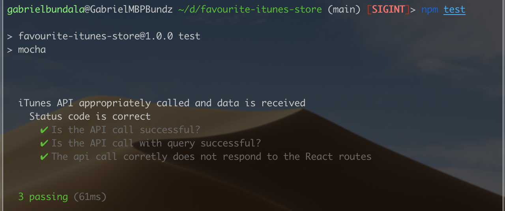
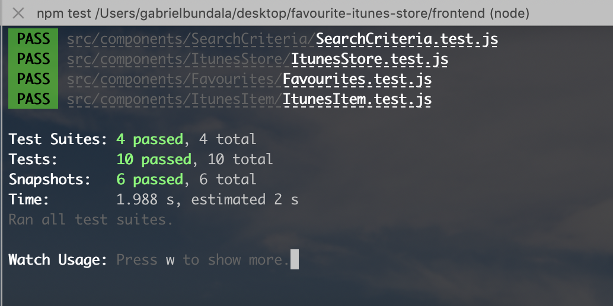
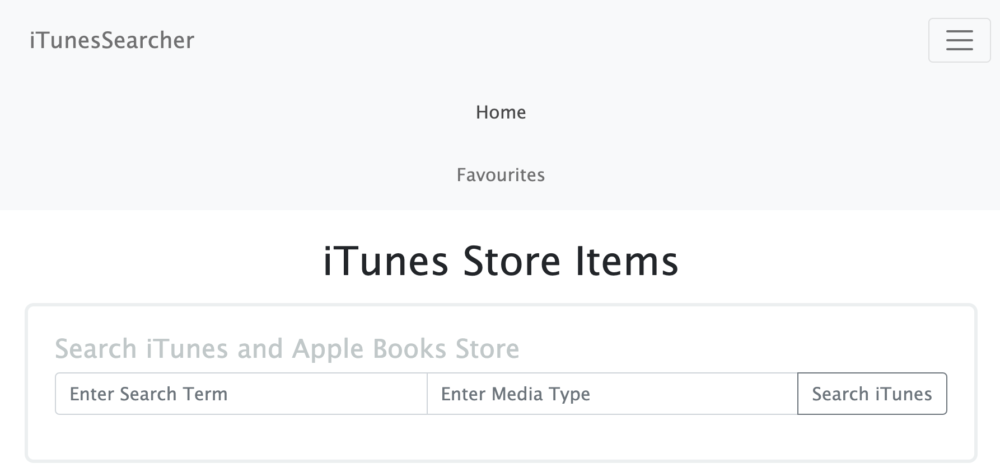
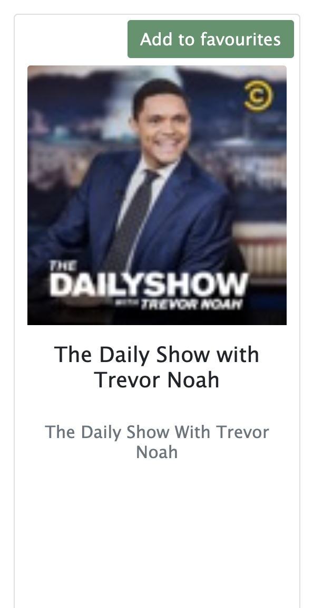
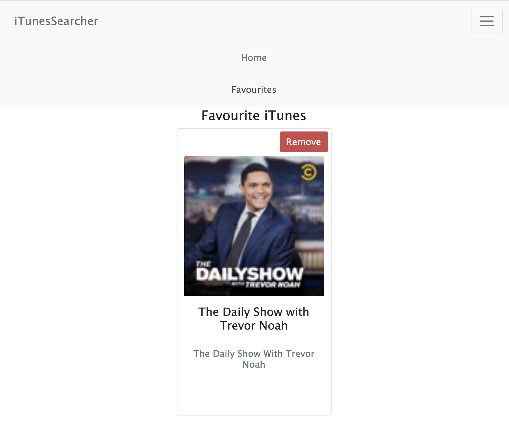

# Favourite iTunes Store

## Table of Contents

1. Installing, testing and using the application
2. Link to the deployed app
3. Frontend part of the application
4. Backend part of the application
5. App security & API keys
6. How to use the application

## Installation, testing and using the application

This application includes both the frontend created with ReactJS and the backend part created with ExpressJS.

If you need to see this application in action in development mode you can download the source files in your local environment then **`npm install`** to install the dependencies. Then you can start the server with **`npm start`**. This command will run the nodemon script that will be restarting the server on each change you make in the code. Then `cd` into the `frontend` directory and do the same by running **`npm install`** to install the ReactJS dependencies in the frontend then run **`npm start`** as well to start the frontend part of the application. Then navigate to http://localhost:3000/.

You may also clone the repo from https://github.com/gbundala/favourite-itunes-store in your local environment or download the zip file from Github and follow the steps above.

If you wish to see the application in action you can visit the deployed application in production hosted on Heroku: https://favourite-itunes-store.herokuapp.com/.

In production, the backend application builds and serves up the frontend application as well. This is accomplished by the `heroku-postbuild` script in the package.json file in the root of the directory.

The application is fully configured to work both in the local development environment as well as in a deployed production environment (in this case, Heroku!).

To test the application, start testing the server in the root folder by navigation to the root folder of the application and running **`npm test`** which will run the test and give the results on the command line similar to the image below.

Then `cd` into the `frontend` directory from the root directly and follow the same step by running **`npm test`** in order to the test the React Application in the frontend.

Once all the tests pass then you are good to go and you can move on the next steps in development such as committing the updated code or deploying to production.

## Link to the deployed application

The deployed application in production is hosted on Heroku and can be accessed through the link : https://favourite-itunes-store.herokuapp.com/.

The github repository of the application can be accessed through the link: https://github.com/gbundala/favourite-itunes-store

## Frontend part of the application

The frontend is created with ReactJS. The main component ItunesStores handles all the data fetching logic which is making the GET requests to the ExpressJS API which is our custom API which then makes the fetch request to the iTunes API. The "fetch" browser API is used to make these data fetching requests in the frontend while we make use of "node-fetch" library to be able to use the fetch method in the backend NodeJS environment.

All the data including the fetch iTunes items and as well as the items saved as favourites are store in the state in the parent **`App.js`** component in order not to loose the state of the fetched itunes items when we navigate to the favourites route.

We make use of `React-Router` library to enable easy and proper navigation in the frontend (client) application due to its powerful API.

Children to the main component mentioned above handle the presentation of the individual added web project items is well as the overall presentation but also allow for the user to trigger actions from the child component to call event handler functions that are defined in the parent.

## Backend part of the application

This RESTful API is created with Express.js, a popular Node.js library that simplifies the development of api with JavaScript.

The routes for the API have been developed in the `routes` directory (inside the `index.js` file) with only one major route to `GET` data from the iTunes API. Inside the route handler is the fetch method which makes the call to the API along with query strings for the Search Term and Media Type.

## App Security and API Keys

To ensure the security of this application, the Helmet library has been used to secure the application.

No API keys were necessary to fetch data from iTunes API, however for any other application that makes use of API keys or any other configuration information such as URLs would be stored in a in **`config`** file inside a config directory (that holds all the configuration information for the application stored in a `.json` or `.js` file).

Scripts, libraries and dependencies used in the application as stored in the `package.json` file in the root directory, such as `npm test` and `npm start` scripts.

## How to use the application

Refer to the installation part at the beginning of this README to get to know how to install the application if you need to use it in your local environment in the browser or navigate to the `heroku` link to be able to access the deployed application.

Favourite iTunes Store application provides you with the User Interface to be able to seach and save in favourites any media that is accessible from the iTunes API.

To be able to search for your media of your interest simply enter the `Search Term` as well as the `Media Type`(e.g. movie, podcast, music, audiobook, short film, TV show, software, ebook or all) in the Home page of the application and then click the `Search iTunes` button to fetch for the media. The Search Term is anything or any keyword that you think can describe the data that you want to be fetched from iTunes (such as name of the artist, name of album, etc.) You may leave the Media Type empty and the fetch would pull all the media types for the Search Term you have specified.

Once the results have been pulled from iTunes into the Home page, once you hover over the cards the `Add to favourites` button will appear and you can click to add the item in your favouries

You can then navigate to the Favourites page of the application to be able to view all your favourite items. You can even remove an item from favourites by clicking the `Remove` button upon hovering over the card

> Enjoy your iTunes Store!
